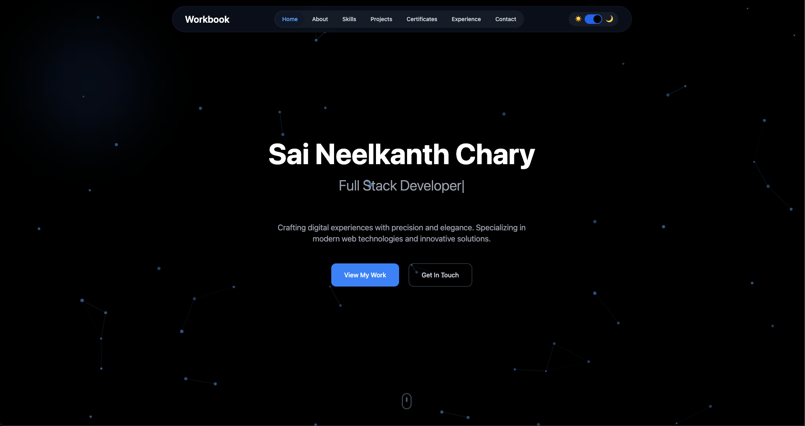

# Saineel's Portfolio Website

<a href="https://saineel.vercel.app"></a>


## 🚀 Overview
A modern, responsive personal portfolio website built with React, TypeScript, and Vite. This portfolio showcases my professional experience, projects, skills, and certifications in an interactive and user-friendly interface.

## ⚡ Tech Stack
- **Frontend Framework**: React with TypeScript
- **Build Tool**: Vite
- **Styling**: TailwindCSS with Shadcn UI components
- **Animation**: Framer Motion
- **Email Service**: EmailJS
- **UI Components**: Radix UI
- **State Management**: React Query

## 🛠️ Features
- Responsive design that works on all devices
- Dark/Light theme support
- Interactive UI components
- Smooth animations and transitions
- Contact form with EmailJS integration
- Project showcase section
- Skills and certifications display
- Professional experience timeline

## 🎨 Project Structure

```plaintext
├── public/             # Static assets
├── src/
│   ├── assets/         # Images and media files
│   ├── components/     # React components
│   ├── contexts/       # React contexts
│   ├── hooks/          # Custom React hooks
│   ├── lib/            # Utility functions and helpers
│   └── pages/          # Page-level components (Home, Projects, etc.)
```

## 📦 Installation

```bash
# Clone the repository
git clone <repository-url>

# Navigate to project directory
cd saineel_portfolio

# Install dependencies
npm install

# Start development server
npm run dev
```

## 🔧 Environment Variables

Create a `.env` file in the root directory and add the following:

```plaintext
VITE_EMAILJS_PUBLIC_KEY=your_emailjs_public_key
VITE_EMAILJS_SERVICE_ID=your_emailjs_service_id
VITE_EMAILJS_TEMPLATE_ID=your_emailjs_template_id
```

## 📜 Available Scripts
```bash
npm run dev        # Start development server
npm run build      # Create production build
npm run build:dev  # Create development build
npm run lint       # Run ESLint for code quality
npm run preview    # Preview production build
```

